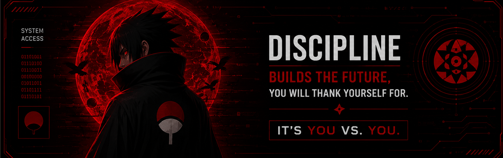

<div align="center">

</div>

<div align="center">

<a href="https://github.com/TheCyberUchiha">

</a>


<br/>


</div>

<br/>

## 🖥️ whoami

```bash
darshak@thecyberuchiha:~$ whoami
```
```json
{
  "name": "Darshak Bhalgamiya",
  "alias": "TheCyberUchiha",
  "role": "Cyber Security Student | Aspiring Security & Web Developer",
  "education": "B.Tech CSE (Cyber Security) — Parul University, Vadodara ('29)",
  "focus": ["Networking", "Linux", "Nmap", "DSA", "Web Development"],
  "currentBuild": "CoreOps — Incident Response & Ticket Management Platform",
  "status": "🏆 Top Performer — Corizo Cyber Security Internship",
  "motto": "It's you vs you."
}
```

---

## 👨‍💻 About Me

- 🎓 2nd-year **B.Tech CSE (Cyber Security)** student at **Parul University**, Vadodara — TFWS government seat
- 🚀 Started with a **State-Level Science Fair** project ("Garbage Management Technique"), then built programming (C, C++, Java) and web dev (HTML, CSS, JS) foundations before moving into applied security
- 🔐 Now focused on **networking, Linux, and hands-on tools** like Nmap, backed by daily DSA practice
- 🏅 Recognized **Top Performer** — Corizo Cyber Security Training & Internship
- 🥷 **Team Leader**, *Cyber Knights* — Smart India Hackathon (SIH) 2025
- 🧠 Motto: *"It's you vs you"* — consistency over speed, fundamentals before complexity
- 🌐 Portfolio: [thecyberuchiha.github.io/Portfolio](https://thecyberuchiha.github.io/Portfolio/)

---

## 🎓 Education

| Qualification | Institution | Duration | Score |
|---|---|---|---|
| B.Tech CSE (Cyber Security) | Parul University, Vadodara (TFWS) | 2025 – 2029 | CGPA 9.0 (Year 1) |
| 12th Standard, Science | Rosary School, Vadodara | 2023 – 2025 | 87% |
| 10th Standard | Nutan Vidhyalaya, Vadodara | 2021 – 2023 | 91% |

---

## 🏆 Experience & Achievements

- 🏆 **Cyber Security Intern — Corizo** (Mar – Apr 2026) — recognized **Top Performer**
- 🥷 **Team Leader, "Cyber Knights"** — Smart India Hackathon (SIH) 2025 — led problem-statement scoping, solution design & final presentation
- 💡 **Participant — Vadodara Hackathon 6.0** (2025) — rapid problem-solving & prototyping
- 🔬 **State-Level Science Fair** — "Garbage Management Technique" project, the spark that started it all

---

## ⚡ Tech Stack & Tools

**Languages & Web**


**Security & Networking Focus**


---

## 📜 Certifications


---

## 💻 Featured Projects

<table>
<tr>
<td width="45%" align="center">

### 🔐 OmniGupt

Modern Encryption & Decryption Web App

<a href="https://github.com/TheCyberUchiha/OmniGupt">

</a>

<br/><br/>

<a href="https://omnigupt.vercel.app">

</a>

</td>

<td width="45%" align="center">

### 🛡 NetShield

Privacy-focused Browser Extension

⭐ Contributor Project

<br/><br/>

<a href="https://netshield-web.vercel.app/">

</a>

</td>
</tr>

<tr>
<td width="45%" align="center">

### 🎫 CoreOps

Incident Response & Ticket Management Platform

⭐ Contributor Project

<br/><br/>

<a href="https://core-ops-wine.vercel.app/">

</a>

</td>

<td width="45%" align="center">

### 🚀 More Coming Soon...

Building exciting Cyber Security & Web Development Projects.

</td>
</tr>
</table>
---

## 📊 GitHub Stats

<p align="center">
  

  
</p>

<p align="center">
  
</p>

<p align="center">
  
</p>

<p align="center">
  
</p>

## 🐍 Contribution Snake

<picture>
  <source
    media="(prefers-color-scheme: dark)"
    srcset="https://raw.githubusercontent.com/TheCyberUchiha/TheCyberUchiha/output/github-contribution-grid-snake-dark.svg">

  
</picture>


---

## 🤝 Connect With Me

<p align="center">
<a href="https://www.linkedin.com/in/darshak-bhalgamiya" target="_blank"></a>
<a href="https://github.com/TheCyberUchiha" target="_blank"></a>
<a href="https://thecyberuchiha.github.io/Portfolio/" target="_blank"></a>
<a href="mailto:the.cyber.uchiha.27@gmail.com"></a>
</p>

<div align="center">

</div>

<br/>

<div align="center">

<i>"It's you vs you."</i>
</div>
